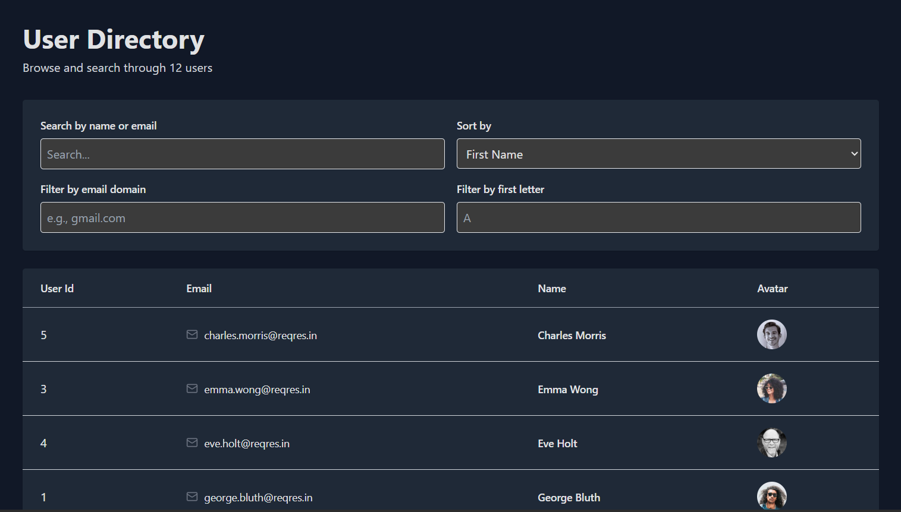
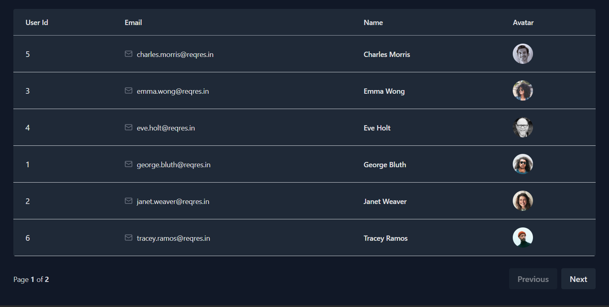

# 🚀 User Directory Table – React + SWR + Tailwind

A simple and responsive **User Directory Web App**.

The application fetches user data from the ReqRes API using the required API key, and includes search, sorting, filtering, and pagination features — all inside a clean UI built with Tailwind CSS.


## 📦 Features

### ✔ Fetch users from API  
Uses authenticated request:

```
GET https://reqres.in/api/users?page=1

Header: x-api-key: reqres-free-v1
```


### ✔ Search  
Search by:

- First Name
- Last Name
- Email

### ✔ Sorting  
Sort table by:

- First Name  
- Email  
- User ID  

### ✔ Filters  
Includes filtering by:

- Email domain (e.g., gmail.com)
- First letter of first name (A–Z)

### ✔ Pagination  
Supports multi-page responses from API.

### ✔ Loading State  
Beautiful loading spinner using `lucide-react`.

### ✔ Fully Responsive  
Modern UI styled with TailwindCSS.

---

## 🛠 Tech Stack

| Technology | Purpose |
|-----------|---------|
| **React** | UI Framework |
| **SWR** | Data fetching & caching |
| **Tailwind CSS** | Styling |
| **Lucide React** | Icons |
| **ReqRes API** | Mock user data |

---

## 📁 Project Structure
```
src/
├── App.jsx # Main component (API fetch, search, filters, sort, pagination)
|── components/
└── user-table.jsx # Table UI component
```

---

## ⚙️ Installation & Setup

Clone the repository:

```bash
git clone https://github.com/SPChandraSai/YourDOST-Assignment.git
cd YourDOST-Assignment/Frontend/User Directory Table Final
```

Install dependencies:
```
npm install
```

Start the dev server:
```
npm run dev

```

Open your browser at:
```
http://localhost:5173/
```
---

🔑 API Key Usage

ReqRes now requires an API key for most pages except page=2.  

**Reason:-** ReqRes updated their API, so only "page=2" is free. All other pages require an API key.

That's why the fetcher includes:
```
const fetcher = (url) =>
  fetch(url, {
    headers: {
      "x-api-key": "reqres-free-v1",
    },
  }).then((r) => r.json());
```

---

📌 API Used
List Users
```
GET https://reqres.in/api/users?page=1
```

Required Header
```
x-api-key: reqres-free-v1
```

---

🖼 Screenshots



---

📤 Deployment
Vercel Deployment
```
https://userdirectorytable.vercel.app/
```

---

🧪 Bonus Features Implemented

✔ Loading spinner  
✔ Responsive UI  
✔ Filters + Search  
✔ Sorting  
✔ Clean code with SWR caching

---

📚 Learnings

- Working with authenticated APIs
- Implementing filtering, searching, and sorting in React
- Data caching with SWR
- Responsive UI design with Tailwind

---

🙌 Author  

S.P. Chandra Sai  
📧 s.p.chandrasai820@gmail.com  
🔗 GitHub: https://github.com/SPChandraSai
